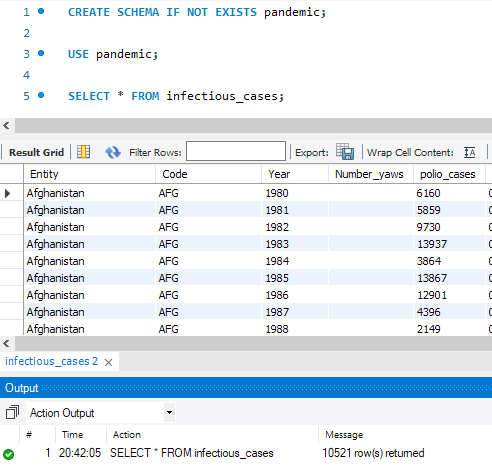
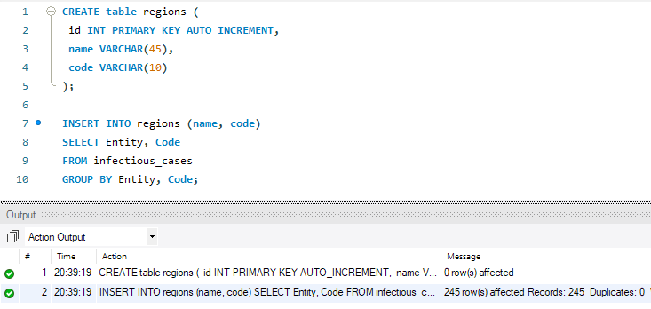
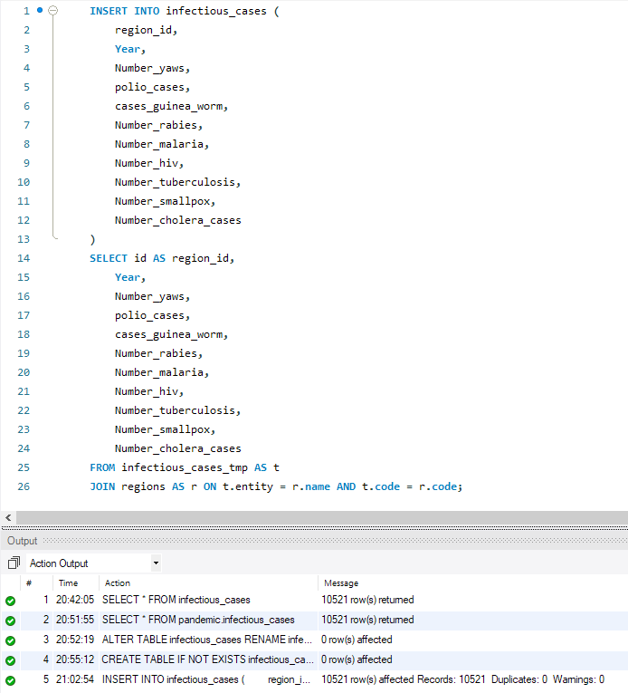
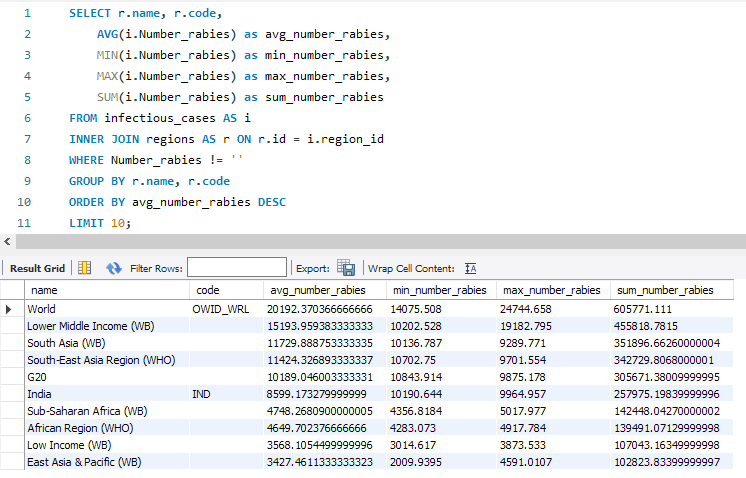
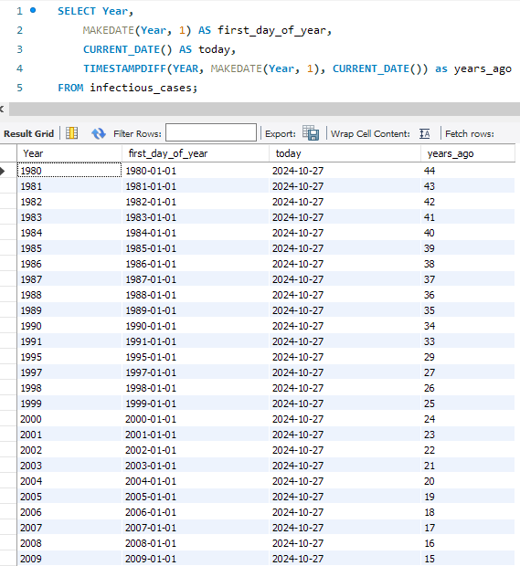
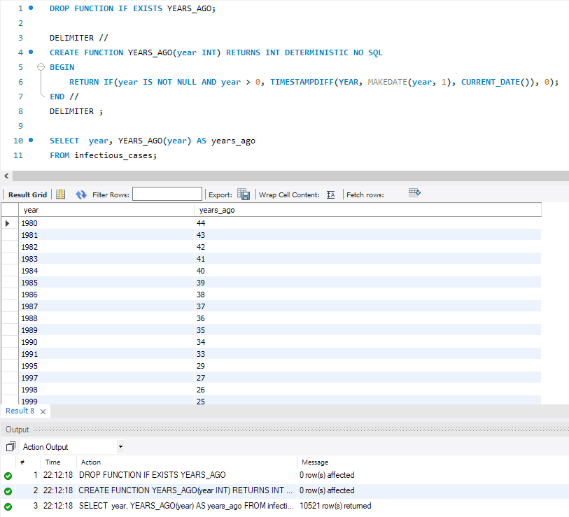

# Relational Databases Final Project

## P1

```sql
CREATE SCHEMA IF NOT EXISTS pandemic;

USE pandemic;
```




## P2

```sql
CREATE table regions (
 id INT PRIMARY KEY AUTO_INCREMENT,
 name VARCHAR(45), 
 code VARCHAR(10)
);

INSERT INTO regions (name, code)
SELECT Entity, Code
FROM infectious_cases
GROUP BY Entity, Code;

ALTER TABLE infectious_cases RENAME infectious_cases_tmp;
```




```sql
ALTER TABLE infectious_cases RENAME infectious_cases_tmp;


CREATE TABLE IF NOT EXISTS infectious_cases (
	id INT PRIMARY KEY AUTO_INCREMENT NOT NULL,
	region_id INT,
	Year INT,
	Number_yaws TEXT,
	polio_cases TEXT,
	cases_guinea_worm TEXT,
	Number_rabies TEXT,
	Number_malaria TEXT,
	Number_hiv TEXT,
	Number_tuberculosis TEXT,
	Number_smallpox TEXT,
	Number_cholera_cases TEXT,
	FOREIGN KEY (region_id) REFERENCES regions(id)
);


INSERT INTO infectious_cases (
	region_id, 
	Year,
	Number_yaws,
	polio_cases,
	cases_guinea_worm,
	Number_rabies,
	Number_malaria,
	Number_hiv,
	Number_tuberculosis,
	Number_smallpox,
	Number_cholera_cases
) 
SELECT id AS region_id,
	Year,
	Number_yaws,
	polio_cases,
	cases_guinea_worm,
	Number_rabies,
	Number_malaria,
	Number_hiv,
	Number_tuberculosis,
	Number_smallpox,
	Number_cholera_cases
FROM infectious_cases_tmp AS t
JOIN regions AS r ON t.entity = r.name AND t.code = r.code;


DROP TABLE infectious_cases_tmp;
```




## P3

```sql
SELECT r.name, r.code,
	AVG(i.Number_rabies) as avg_number_rabies,
	MIN(i.Number_rabies) as min_number_rabies,
	MAX(i.Number_rabies) as max_number_rabies,
	SUM(i.Number_rabies) as sum_number_rabies
FROM infectious_cases AS i
INNER JOIN regions AS r ON r.id = i.region_id
WHERE Number_rabies != ''
GROUP BY r.name, r.code 
ORDER BY avg_number_rabies DESC 
LIMIT 10;
```




## P4

```sql
SELECT Year,
	MAKEDATE(Year, 1) AS first_day_of_year,
	CURRENT_DATE() AS today,
	TIMESTAMPDIFF(YEAR, MAKEDATE(Year, 1), CURRENT_DATE()) as years_ago
FROM infectious_cases;
```




## P5

```sql
DROP FUNCTION IF EXISTS YEARS_AGO;

DELIMITER //
CREATE FUNCTION YEARS_AGO(year INT) RETURNS INT DETERMINISTIC NO SQL
BEGIN
	RETURN IF(year IS NOT NULL AND year > 0, TIMESTAMPDIFF(YEAR, MAKEDATE(year, 1), CURRENT_DATE()), 0); 
END //
DELIMITER ;

SELECT  year, YEARS_AGO(year) AS years_ago
FROM infectious_cases;
```

